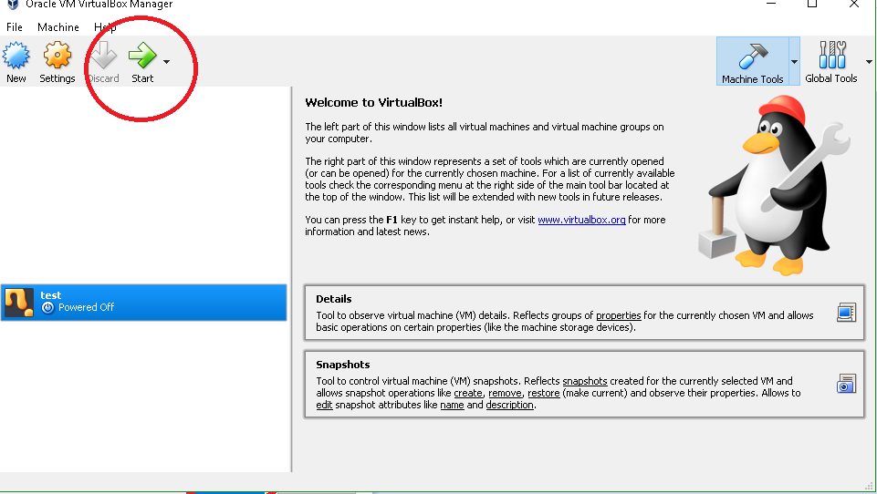

# HexingBootsectors
This repo is basically just a collection of bootsectors as recently ive been interested in fitting code in small locations.
These are made with a mix of reading a opcode table and writing in HxD such as for typing.img or using an assembler with the
case of colorful.img.
I also want to make tools to help me write these at a higher level and put them here.
 
<h2>How to load one:</h2>
<b>step 1:</b> 
 
<b><u>step 2:</u></b> 

<b>step 3:</b> 

<b>step 4:</b> 

<b>step 5:</b> 

<b>step 6:</b> 

<b>step 7:</b> 

 
<h2>How to build your own (TBA):</h2>

<h2>Resources:</h2>
